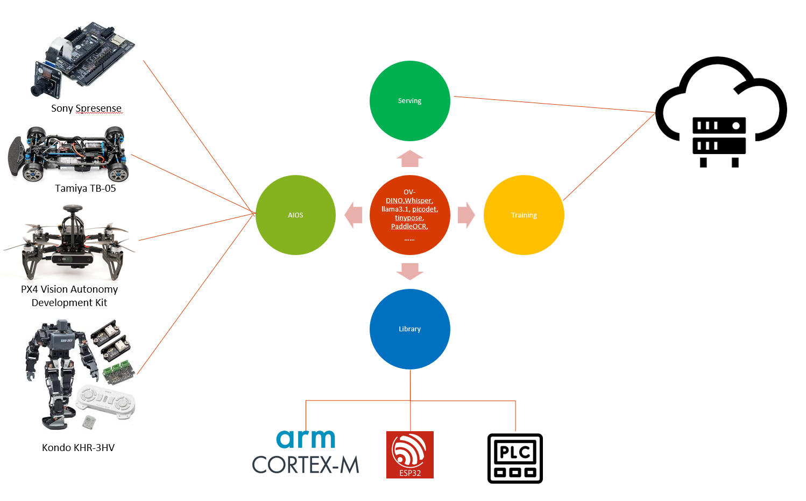

# Auto-X Engine

Auto-X Engine is a full-fledged, performance first, and model-oriented training/inference framework that could be used for mobile, edge and cloud scenarios. It is written entirely in C and can also be migrated to nearly all edge devices. Most of the codes are adapted from [ggml](https://github.com/ggerganov/ggml), [Paddle Lite](https://github.com/PaddlePaddle/Paddle-Lite),
[OpenCV](https://github.com/opencv/opencv), [onnx2c](https://github.com/kraiskil/onnx2c), [llama2.c](https://github.com/karpathy/llama2.c) and so on.

Auto-X Engine Serving is a serving software that streamlines AI inferencing. It enables users to deploy AI models using Auto-X Inference Engine. It supports inference across cloud, data center, edge and embedded devices on NVIDIA GPUs, x86 and ARM CPU, or AWS Inferentia. It also delivers optimized performance for many query types, including real time, batched, ensembles and audio/video streaming.

> **Note** This engine only supports the model structures described in this repo. 
> These models could be modified from the originial ones.
> We also provide guidelines or running code to customize and retrain the following models using your own data.

  

## Models

### Tiny Models

- [PaddleOCR](./models/paddleocr/)
- [picodet](./models/picodet/)
- [pp_liteseg](./models/pp_liteseg/)
- [ShuffleNetV2](./models/shufflenetv2/)
- [tinypose](./models/tinypose/)

### Big Models
- [chatglm](./models/chatglm/)
- [clip](./models/clip/)
- [gpt-2](./models/gpt-2/)
- [llama](./models/llama/)
- [minigpt4](./models/minigpt4/)
- [qwen](./models/qwen/)
- [sam](./models/sam/)
- [stable-diffusion](./models/stable-diffusion/)
- [vit](./models/vit/)
- [whisper](./models/whisper/)

## Serving

### Build and Deploy

The recommended way to build and use Triton Inference Server is with Docker
images.

- [Install Triton Inference Server with Docker containers](docs/customization_guide/build.md#building-with-docker) (*Recommended*)
- [Install Triton Inference Server without Docker containers](docs/customization_guide/build.md#building-without-docker)
- [Build a custom Triton Inference Server Docker container](docs/customization_guide/compose.md)
- [Build Triton Inference Server from source](docs/customization_guide/build.md#building-on-unsupported-platforms)
- [Build Triton Inference Server for Windows 10](docs/customization_guide/build.md#building-for-windows-10)
- Examples for deploying Triton Inference Server with Kubernetes and Helm on [GCP](deploy/gcp/README.md),
  [AWS](deploy/aws/README.md), and [NVIDIA FleetCommand](deploy/fleetcommand/README.md)
- [Secure Deployment Considerations](docs/customization_guide/deploy.md)

### Using Triton

#### Preparing Models for Triton Inference Server

The first step in using Triton to serve your models is to place one or
more models into a [model repository](docs/user_guide/model_repository.md). Depending on
the type of the model and on what Triton capabilities you want to enable for
the model, you may need to create a [model
configuration](docs/user_guide/model_configuration.md) for the model.

- [Add custom operations to Triton if needed by your model](docs/user_guide/custom_operations.md)
- Enable model pipelining with [Model Ensemble](docs/user_guide/architecture.md#ensemble-models)
  and [Business Logic Scripting (BLS)](https://github.com/triton-inference-server/python_backend#business-logic-scripting)
- Optimize your models setting [scheduling and batching](docs/user_guide/architecture.md#models-and-schedulers)
  parameters and [model instances](docs/user_guide/model_configuration.md#instance-groups).
- Use the [Model Analyzer tool](https://github.com/triton-inference-server/model_analyzer)
  to help optimize your model configuration with profiling
- Learn how to [explicitly manage what models are available by loading and
  unloading models](docs/user_guide/model_management.md)

#### Configure and Use Triton Inference Server

- Read the [Quick Start Guide](docs/getting_started/quickstart.md) to run Triton Inference
  Server on both GPU and CPU
- Triton supports multiple execution engines, called
  [backends](https://github.com/triton-inference-server/backend#where-can-i-find-all-the-backends-that-are-available-for-triton), including
  [TensorRT](https://github.com/triton-inference-server/tensorrt_backend),
  [TensorFlow](https://github.com/triton-inference-server/tensorflow_backend),
  [PyTorch](https://github.com/triton-inference-server/pytorch_backend),
  [ONNX](https://github.com/triton-inference-server/onnxruntime_backend),
  [OpenVINO](https://github.com/triton-inference-server/openvino_backend),
  [Python](https://github.com/triton-inference-server/python_backend), and more
- Not all the above backends are supported on every platform supported by Triton.
  Look at the
  [Backend-Platform Support Matrix](https://github.com/triton-inference-server/backend/blob/main/docs/backend_platform_support_matrix.md)
  to learn which backends are supported on your target platform.
- Learn how to [optimize performance](docs/user_guide/optimization.md) using the
  [Performance Analyzer](https://github.com/triton-inference-server/client/blob/main/src/c++/perf_analyzer/README.md)
  and
  [Model Analyzer](https://github.com/triton-inference-server/model_analyzer)
- Learn how to [manage loading and unloading models](docs/user_guide/model_management.md) in
  Triton
- Send requests directly to Triton with the [HTTP/REST JSON-based
  or gRPC protocols](docs/customization_guide/inference_protocols.md#httprest-and-grpc-protocols)

#### Client Support and Examples

A Triton *client* application sends inference and other requests to Triton. The
[Python and C++ client libraries](https://github.com/triton-inference-server/client)
provide APIs to simplify this communication.

- Review client examples for [C++](https://github.com/triton-inference-server/client/blob/main/src/c%2B%2B/examples),
  [Python](https://github.com/triton-inference-server/client/blob/main/src/python/examples),
  and [Java](https://github.com/triton-inference-server/client/blob/main/src/java/src/main/java/triton/client/examples)
- Configure [HTTP](https://github.com/triton-inference-server/client#http-options)
  and [gRPC](https://github.com/triton-inference-server/client#grpc-options)
  client options
- Send input data (e.g. a jpeg image) directly to Triton in the [body of an HTTP
  request without any additional metadata](https://github.com/triton-inference-server/server/blob/main/docs/protocol/extension_binary_data.md#raw-binary-request)

## Reference

- [Triton Inference Server](https://github.com/triton-inference-server/server)
- [Apache NuttX](https://github.com/apache/nuttx)
- [PX4 NuttX](https://github.com/PX4/NuttX)
- [Spresense NuttX](https://github.com/sonydevworld/spresense-nuttx)
- [PX4 NuttX apps](https://github.com/PX4/NuttX-apps)
- [Spresense NuttX apps](https://github.com/sonydevworld/spresense-nuttx-apps)