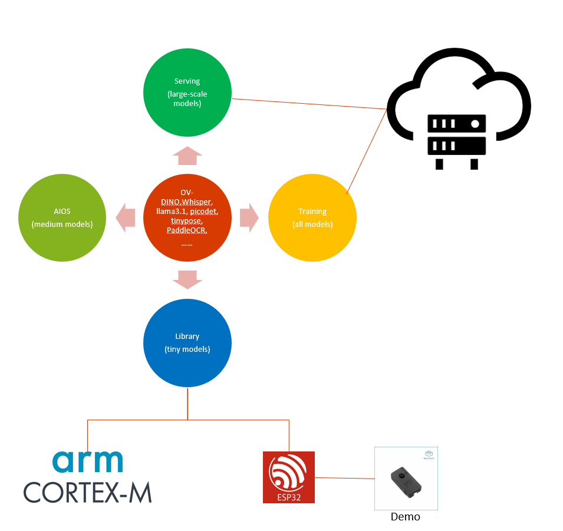

# Auto-X Engine

Auto-X Engine is a full-fledged, performance first, and model-oriented training/inference framework that could be used for mobile, edge and cloud scenarios. It is written entirely in C and can also be migrated to nearly all edge devices. Most of the codes are adapted from [ggml](https://github.com/ggerganov/ggml), [Paddle Lite](https://github.com/PaddlePaddle/Paddle-Lite),
[OpenCV](https://github.com/opencv/opencv), [onnx2c](https://github.com/kraiskil/onnx2c), [llama2.c](https://github.com/karpathy/llama2.c) and so on.

Auto-X Engine Serving enables users to deploy Auto-X models using Auto-X Inference Engine. It also delivers optimized performance for LLM, MLLM, and other industrial models.

[Auto-X AIOS](https://github.com/HairongWu/Auto-X-AIOS) (based on NuttX)

> **Note** This engine only supports the model structures described in this repo. 
> These models could be modified from the originial ones.

  

